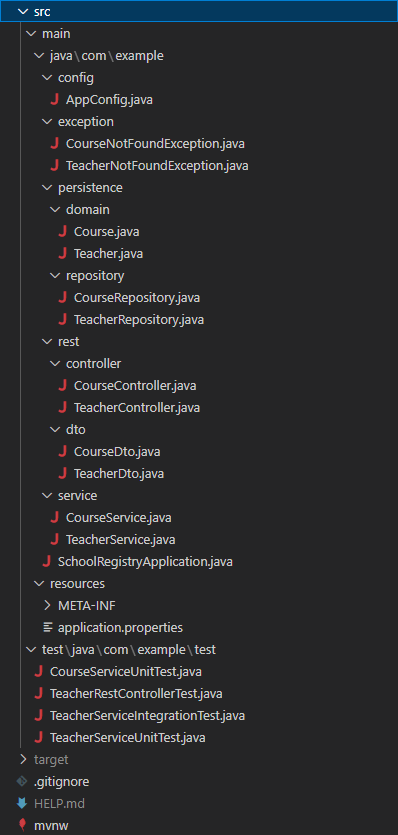

# School-Registry
### Will Thrussell - QA Final Project

### Links
[The Jira board for this project can be found here.](https://wjt94.atlassian.net/jira/core/projects/SCHOOL/board)

### Description
This project serves as a simple backend app for a MySQL database, handling "teacher" objects with one-to-many "courses". Both models have full CRUD functionality, with endpoints for HTTP requests to both read and modify the data.

#### Why are we doing this?
_The application is designed to be implemented into a school's server, where teachers instruct students on multiple courses. Through this app, and the database it supports, a teacher's courses can be registered, found, modified, and deleted with HTTP requests._

### Features
* Teachers
  * Add teacher
  * Read all teacher details
  * Read teacher details by id
  * Update teacher details
  * Delete teacher

* Courses
  * Add course
  * Read all course details
  * Read course details by id
  * Update course details
  * Delete course
  
### Installation & Running
1. Ensure port 8080 is free.
2. Create a MySQL database named `schoolregistry`, running on port 3306. 
   _(NOTE: The application port, database port, and database name can all be configured in src/main/resources/application.properties)_
3. Run the project as a Spring Boot App.
4. You can now create HTTP requests to the database. Examples are shown in the images below.

### Project Structure

### Database Model

### HTTP Requests
All requests: 

Create teacher 

Read all teachers 

Read teacher by ID 

Read teacher(s) by name 

Update teacher by ID 

Delete teacher by ID 

Create course 

Read all courses 

Read course by ID 

Read course(s) by name 

Update course by ID 

Delete course by ID 

### Testing

### Tools Used
* Java 8
* Spring Boot 2.7.0
* MySQL 8.0.30
* Maven 4.0.0
* Visual Studio Code 1.72.2
* Github
* Jira

### Reflection
Overall the application came together well. As this project involves me learning Java, there were a few pitfalls involving datatypes and object-oriented-programming in general that I struggled to understand at first. Many of the functioning parts of this application are very abstract, which made it difficult at times for me to visualize the sequence of methods in the program. Fortunately, modern IDEs are very good at handling this problem, and helped me to better understand Java as a whole.

Possible improvements would be mostly based on implementing new features. A real school registry would likely require another table for students, and another table for the grades/marks the students receive in individual courses. Through this, other functionality to could be present, all the way down to individual assignments having registered scores, teacher comments, or other details, allowing this to serve as the backend for a truly exhaustive registry for a school.

Another larger improvement would involve a frontend application that could handle the HTTP requests, to allow for a user-friendly experience for reading from or writing to the registry - however, a frontend application would be outside the scope of this project.
